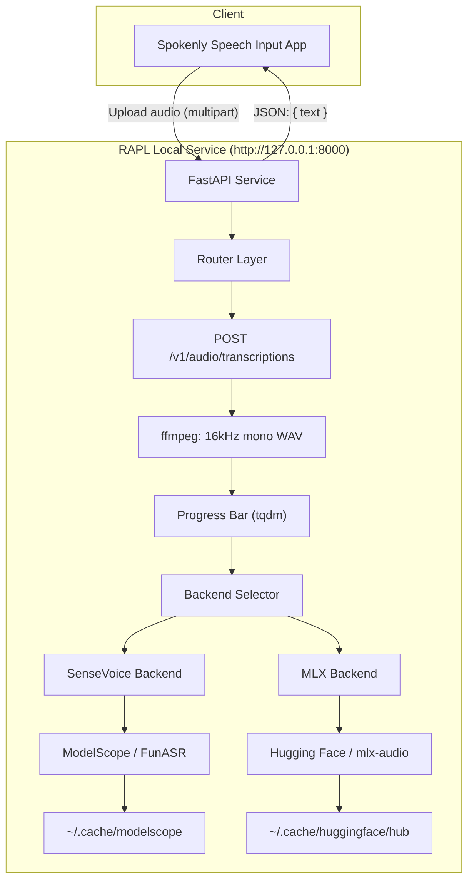
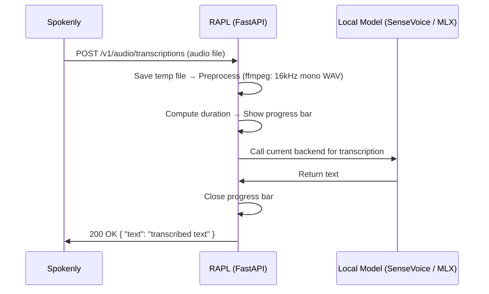

# Acknowledgement to @astordu

Special thanks to **雷哥** for providing the initial implementation and foundational code for this project.  
雷哥's `openai_whisper_compatible_api.py` and integration ideas with Spokenly have provided a clear template for building a local, switchable-backend speech-to-text service. This has inspired the support for multi-model and MLX backends.

We sincerely appreciate their open-source contribution and inspiration.

# RAPL — Local Speech-to-Text API

RAPL (Remote Audio Processing Layer) is an OpenAI-compatible speech-to-text (ASR) API service that runs locally. It supports multiple backend models and can work with front-end speech input apps like Spokenly—no need to upload audio to the cloud.

---

## 1. How to Use RAPL and Supported Models

### Requirements & Installation

- Python 3.10+
- Recommended: use a virtual environment

```bash
# After cloning or extracting the project, change to the directory
cd local-asr-api # folder name

# Create virtual environment (optional)
python3 -m venv .venv
source .venv/bin/activate   # Windows: .venv\Scripts\activate

# Install dependencies
pip install -r requirements.txt
```

If you want to use the **MLX backend** (recommended on macOS Apple Silicon), you’ll need `torch` and `torchaudio` installed. If you see `No module named 'torch'`, run:

```bash
pip install torch torchaudio
```

### Configure Backend and Model

You can select the backend and model via environment variables (or set the defaults at the top of `openai_whisper_compatible_api.py`):

| Variable     | Description      | Example                       |
|--------------|------------------|-------------------------------|
| `BACKEND`    | Backend engine   | `sensevoice` or `mlx`         |
| `LOCAL_MODEL`| Model id (HF or ModelScope id) | See table below      |

**Currently Supported Models:**

| Backend      | Model ID                          | Description (EN)                               | Cache Dir                      |
|--------------|-----------------------------------|------------------------------------------------|-------------------------------|
| **SenseVoice** | `iic/SenseVoiceSmall`           | Multilingual, emotion/event detection (FunASR / ModelScope) | `~/.cache/modelscope/hub/` |
| **MLX**       | `mlx-community/Qwen3-ASR-1.7B-8bit` | Faster inference on Mac (Hugging Face)         | `~/.cache/huggingface/hub/` |

Models will be downloaded automatically to the above cache directories the first time you run them, then loaded from cache afterward.

### Start the Service

```bash
# Using SenseVoice (default)
python openai_whisper_compatible_api.py

# Using MLX (e.g. on Mac)
export BACKEND=mlx
export LOCAL_MODEL=mlx-community/Qwen3-ASR-1.7B-8bit
python openai_whisper_compatible_api.py
```

By default, the service listens on **http://127.0.0.1:8000**. A progress bar will display in the terminal showing transcription progress.

### Switch to Other MLX Models

If new MLX-format ASR models appear on Hugging Face, just change the environment variables and restart—no code modification needed:

```bash
export BACKEND=mlx
export LOCAL_MODEL=mlx-community/your-new-model
python openai_whisper_compatible_api.py
```

---

## 2. Usage with Spokenly Speech Input App

RAPL implements an **OpenAI Whisper API**-compatible interface, so you can use it with any speech app that supports "OpenAI Compatible API" mode, such as **Spokenly**.

### Setting Up in Spokenly

1. Open Spokenly’s **Dictation Models** settings.
2. Select **“OpenAI Compatible API”** or **“</> API”** type.
3. Fill out the settings:
   - **URL**: `http://127.0.0.1:8000` (must match RAPL’s address)
   - **Model**: The same as used by RAPL, e.g. `mlx-community/Qwen3-ASR-1.7B-8bit` or `iic/SenseVoiceSmall`
   - **API Key**: Not required for local use, just fill with any value (e.g. `anything`)
4. Click **Test & Save**.

### Data Flow Explanation

- Spokenly records speech and sends it to RAPL on your local machine.
- RAPL transcribes using a local model—**your audio never leaves your device**, making it privacy-friendly.
- The transcription result is returned to Spokenly, in OpenAI-compatible format, for dictation, subtitles, etc.

If Spokenly or your system requires HTTPS, you can set up a local reverse proxy or TLS termination. By default, RAPL is HTTP only.

---

## 3. Audio Preprocessing

RAPL automatically preprocesses uploaded audio before inference using `ffmpeg`. All incoming audio is converted to **16kHz mono 16-bit WAV** — the optimal format for ASR models. This happens transparently; callers do not need to change anything.

### Why Preprocess?

ASR models only need 16kHz mono audio. Most input files are higher quality than necessary (44.1kHz stereo, lossless formats, etc.). Downsampling before inference reduces memory usage and improves processing speed.

### Requirements

- **ffmpeg** must be installed on the system (`brew install ffmpeg` on macOS, `apt install ffmpeg` on Linux).
- If ffmpeg is not available, RAPL gracefully falls back to using the original uploaded file — nothing breaks.

### Performance Impact

| Metric | Without Preprocessing | With Preprocessing |
|---|---|---|
| Raw waveform in RAM (30s, 44.1kHz stereo) | ~5.3 MB | ~960 KB (**~5.5x reduction**) |
| Raw waveform in RAM (30s, 16kHz mono) | ~960 KB | ~960 KB (no change) |
| Transcription speed (short utterances, 5-15s) | baseline | ~**5-10% faster** |
| Transcription speed (longer audio, 60s+) | baseline | ~**10-20% faster** |

**Note:** The neural network forward pass (the main bottleneck) operates on fixed-rate feature frames regardless of input sample rate. The speed gain comes from faster file loading and feature extraction. The bigger win is **memory reduction**, which improves stability on memory-constrained machines or with long recordings.

---

## 4. RAPL Architecture Diagram

Below is the overall architecture of RAPL working with Spokenly (see Mermaid diagram in supported Markdown previewers):



**Simplified Data Flow:**




---

## Appendix

- **API Script**: `openai_whisper_compatible_api.py`
- **Dependencies**: `requirements.txt`
- **Changelog/Design Notes**: See `CHANGELOG.md`
- **SenseVoice original info and citation**: See [ModelScope](https://www.modelscope.cn/models/iic/SenseVoiceSmall) / [FunASR](https://github.com/modelscope/FunASR)
