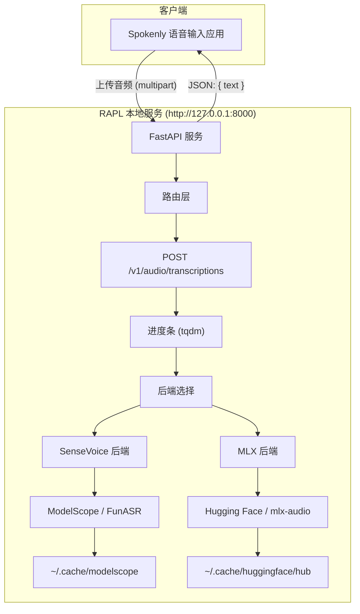
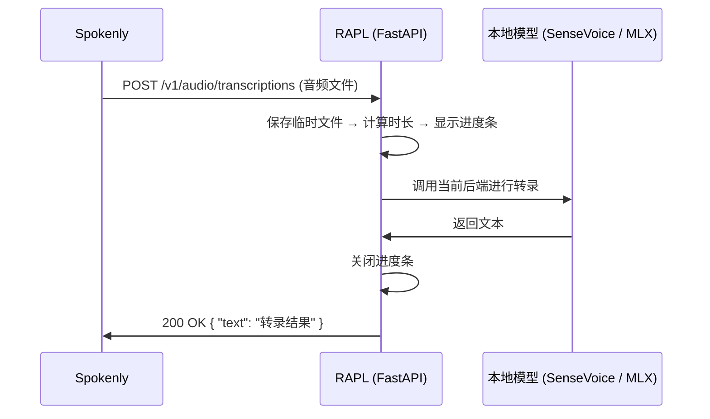

# 致谢 - Acknowledgement to @astordu

感谢 **雷哥** 提供本项目的初始实现与基础代码。  
雷哥的 `openai_whisper_compatible_api.py` 及与 Spokenly 的集成思路，为本地化、可切换后端的语音转文字服务提供了清晰范本，对后续扩展多模型与 MLX 支持具有重要启发。  

谨此表达对其开源贡献与启发性的感谢。

# RAPL — 本地语音转文字 API

RAPL（Remote Audio Processing Layer）是一个本地运行的、兼容 OpenAI 格式的语音转文字（ASR）API 服务。支持多种后端模型，可与 Spokenly 等前端语音输入应用配合使用，无需将音频上传到云端。

---

## 1. 如何使用 RAPL 与当前支持的模型

### 环境要求与安装

- Python 3.10+
- 建议使用虚拟环境

```bash
# 克隆或解压项目后，进入项目目录
cd local-asr-api # 文件夹名字

# 创建虚拟环境（可选）
python3 -m venv .venv
source .venv/bin/activate   # Windows: .venv\Scripts\activate

# 安装依赖
pip install -r requirements.txt
```

若使用 **MLX 后端**（推荐在 macOS Apple Silicon 上使用），需已安装 `torch` 与 `torchaudio`；若出现 `No module named 'torch'`，请执行：

```bash
pip install torch torchaudio
```

### 配置后端与模型

通过环境变量选择后端和模型（也可在 `openai_whisper_compatible_api.py` 顶部修改默认值）：

| 环境变量 | 说明 | 示例 |
|----------|------|------|
| `BACKEND` | 推理后端 | `sensevoice` 或 `mlx` |
| `LOCAL_MODEL` | 模型标识（HF 或 ModelScope 的模型 ID） | 见下表 |

**当前支持的模型**

| 后端 | 模型标识 | 说明 | 缓存目录 |
|------|----------|------|----------|
| **SenseVoice** | `iic/SenseVoiceSmall` | 多语言、情感与事件检测（FunASR / ModelScope） | `~/.cache/modelscope/hub/` |
| **MLX** | `mlx-community/Qwen3-ASR-1.7B-8bit` | 在 Mac 上推理更快（Hugging Face） | `~/.cache/huggingface/hub/` |

首次运行时会自动下载模型到上述缓存目录，之后将直接使用本地缓存。

### 启动服务

```bash
# 使用 SenseVoice（默认）
python openai_whisper_compatible_api.py

# 使用 MLX（例如在 Mac 上）
export BACKEND=mlx
export LOCAL_MODEL=mlx-community/Qwen3-ASR-1.7B-8bit
python openai_whisper_compatible_api.py
```

服务默认监听 **http://127.0.0.1:8000**。终端会显示进度条，表示当前转录处理进度。

### 切换为其他 MLX 模型

若 Hugging Face 上有新的 MLX 格式 ASR 模型，只需更换环境变量并重启服务，无需改代码：

```bash
export BACKEND=mlx
export LOCAL_MODEL=mlx-community/你的新模型名
python openai_whisper_compatible_api.py
```

---

## 2. 与前端语音输入应用 Spokenly 的配合方式

RAPL 实现与 **OpenAI Whisper API** 兼容的接口，因此可与支持「OpenAI 兼容 API」的语音输入应用配合使用，例如 **Spokenly**。

### 在 Spokenly 中配置

1. 打开 Spokenly 的 **Dictation Models**（听写模型）设置。
2. 选择 **「OpenAI Compatible API」** 或 **「</> API」** 类型。
3. 填写：
   - **URL**：`http://127.0.0.1:8000`（确保与 RAPL 启动的地址一致）
   - **Model**：与当前 RAPL 使用的模型一致，例如 `mlx-community/Qwen3-ASR-1.7B-8bit` 或 `iic/SenseVoiceSmall`
   - **API Key**：本地服务可不校验，填写任意值（如 `anything`）即可
4. 点击 **Test & Save** 测试并保存。

### 数据流说明

- 语音由 **Spokenly** 采集并发送到本机 **RAPL**。
- RAPL 使用本地模型进行转录，**音频不离开本机**，适合注重隐私的场景。
- 转录结果按 OpenAI 格式返回给 Spokenly，用于听写、字幕等。

若 Spokenly 或系统要求 HTTPS，可在本机配置反向代理或 TLS；默认提供的是 HTTP 服务。

---

## 3. RAPL 架构图

以下为 RAPL 服务与 Spokenly 配合时的整体架构（Mermaid 图可在支持 Mermaid 的 Markdown 预览中查看）。



**简化数据流：**




---

## 附录

- **API 脚本**：`openai_whisper_compatible_api.py`
- **依赖列表**：`requirements.txt`
- **变更与设计说明**：见 `CHANGELOG.md`
- **SenseVoice 原始介绍与引用**：可参阅 [ModelScope](https://www.modelscope.cn/models/iic/SenseVoiceSmall) / [FunASR](https://github.com/modelscope/FunASR)
